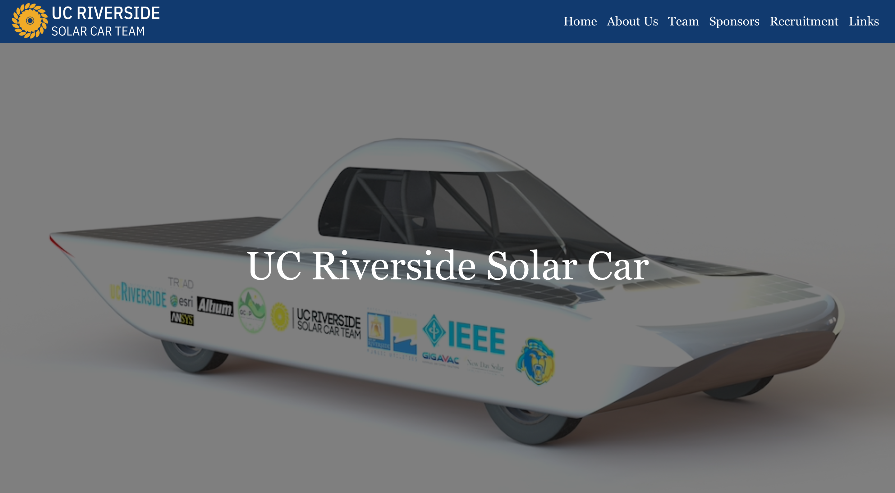

# UC Riverside Solar Car Website

The official UC Riverside Solar Car website codebase. Built using React, React-Bootstrap, and React-Router.
Contains information regarding various subteams, goals, achievements, and recruitment information. Visit the deployed 
version at [ucrsolarcar.com] (https://ucrsolarcar.com)

## Available Scripts

In the project directory, you can run:

### `npm start`

Runs the app in the development mode.\
Open [http://localhost:3000](http://localhost:3000) to view it in the browser.

The page will reload if you make edits.\
You will also see any lint errors in the console.

### `npm run build`

Builds the app for production to the `build` folder.\
It correctly bundles React in production mode and optimizes the build for the best performance.

The build is minified and the filenames include the hashes.\
Your app is ready to be deployed!

See the section about [deployment](https://facebook.github.io/create-react-app/docs/deployment) for more information.

### `npm run deploy`

Builds the app for production to the `build` folder and deploys to github-pages branch.\
It correctly bundles React in production mode and optimizes the build for the best performance.

The build is minified and the filenames include the hashes.\

See the section about [deployment](https://github.com/gitname/react-gh-pages) for more information.